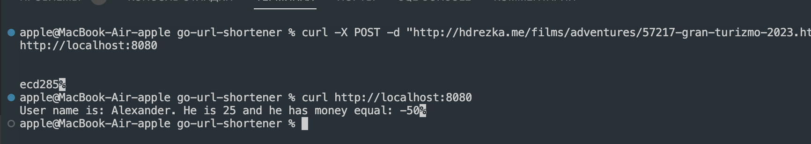

# Go URL Shortener

Простой и эффективный сокращатель ссылок, написанный на Golang.

## Особенности

- **Преобразование URL**: Превращает длинные URL-ссылки в короткие и лаконичные.
- **Простота использования**: Интуитивно понятная и легкая в использовании структура.
- **Безопасность**: Использует хеширование SHA-256 для генерации коротких URL-ссылок.

## Начало работы

### Установка

Для начала убедитесь, что у вас установлен Golang. Затем клонируйте репозиторий:

